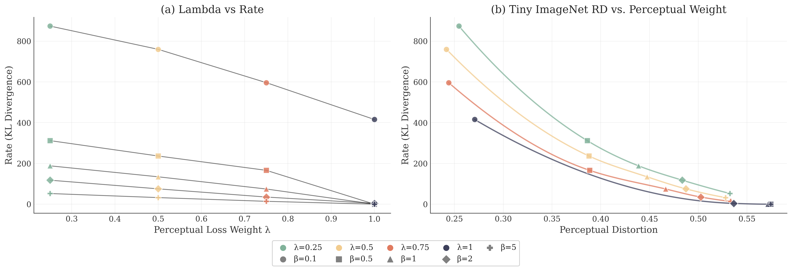
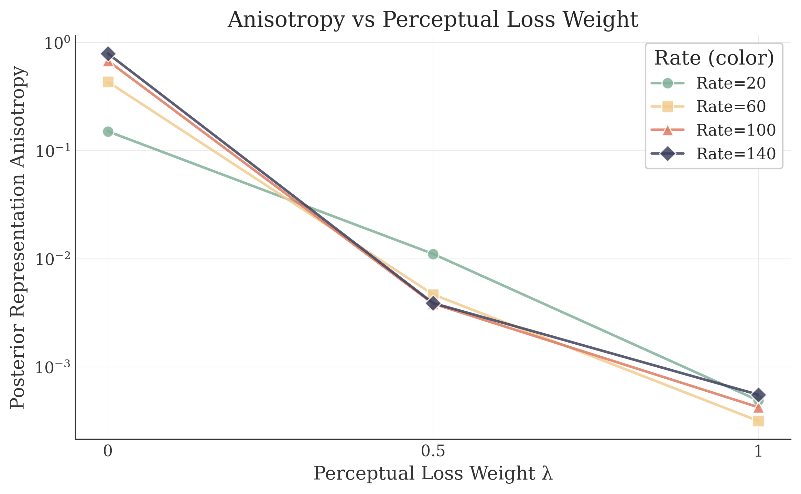
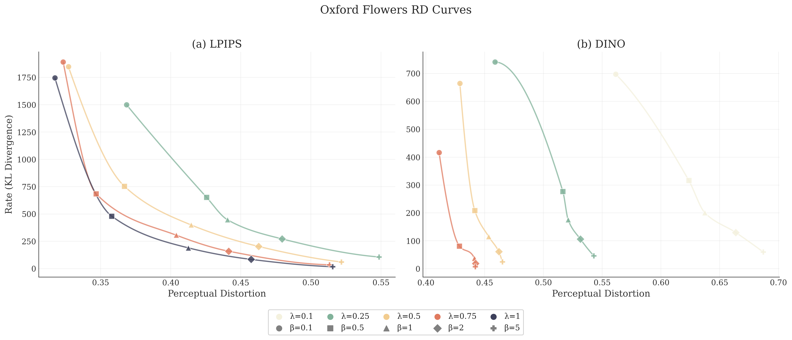
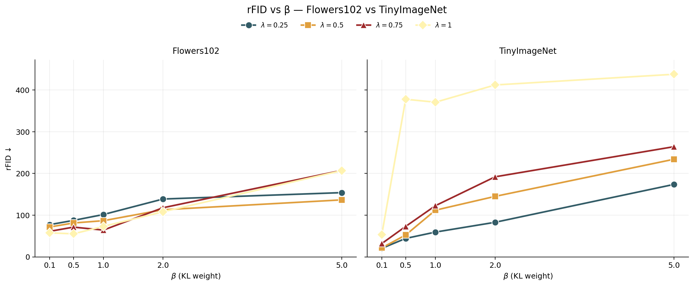
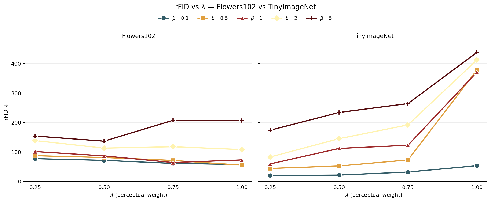
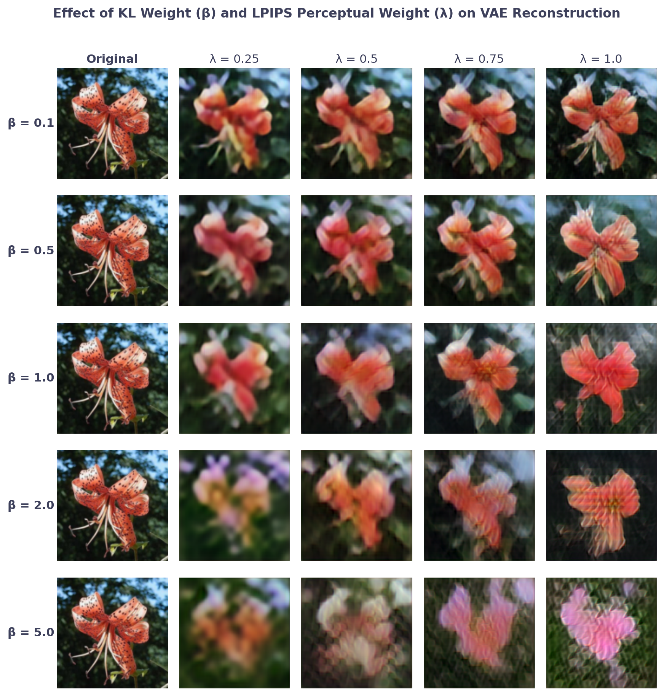
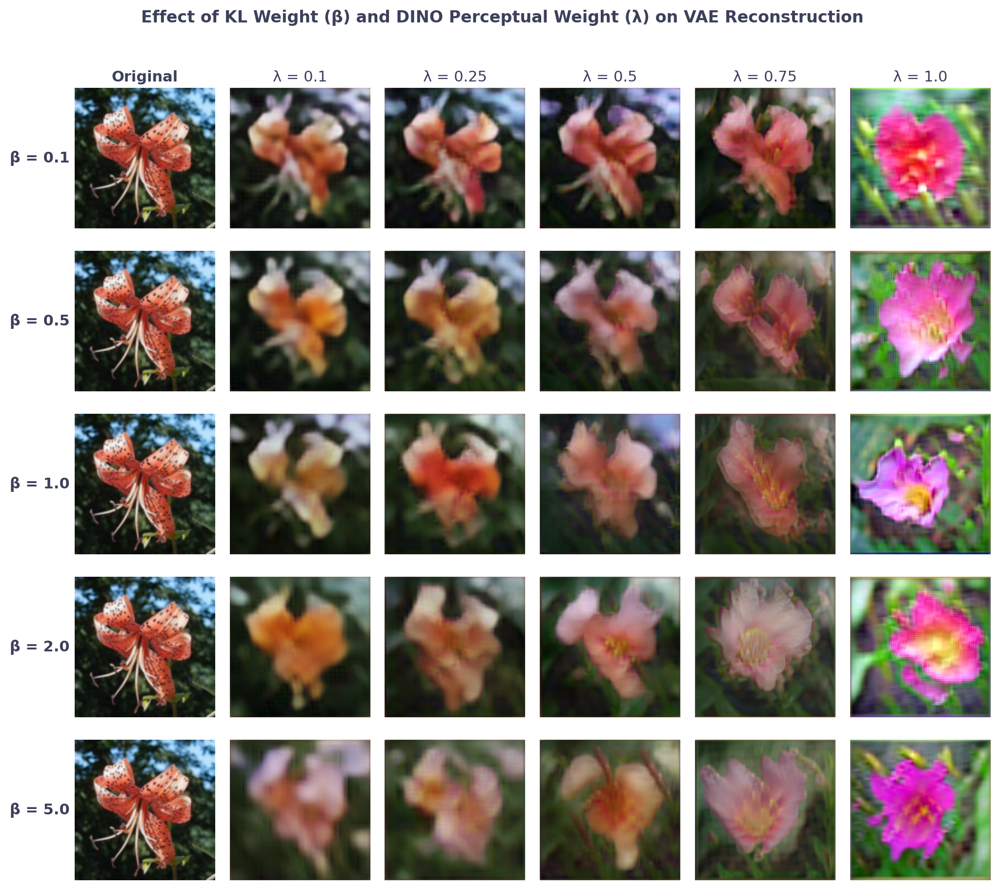

# ICML 2026 Rebuttal - Distortion Controls Rate: How VAEs Shape Latent Geometry

Supplementary figures for the rebuttal of our ICML 2026 submission.

# Tiny-ImageNet

### Section 4.1 - Perceptual loss weight vs. Rate

### Section 4.2 - Anisotropy vs. Perceptual loss weight

# Oxford Flowers 102

### RD curves for LPIPS-VGG vs. DINOv2

# Distributional distance with InceptionV3-FID

### InceptionV3-FID vs. Beta (KL loss weight)

### InceptionV3-FID vs. Lambda (LPIPS-VGG perceptual loss weight)

# Reconstructions at varying Lambda (perceptual loss weight) and Beta (KL weight)

### Reconstructions with LPIPS-VGG perceptual loss

### Reconstructions with DINOv2 perceptual loss

