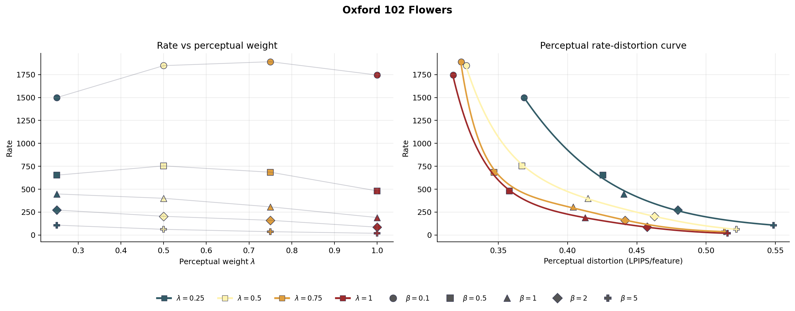
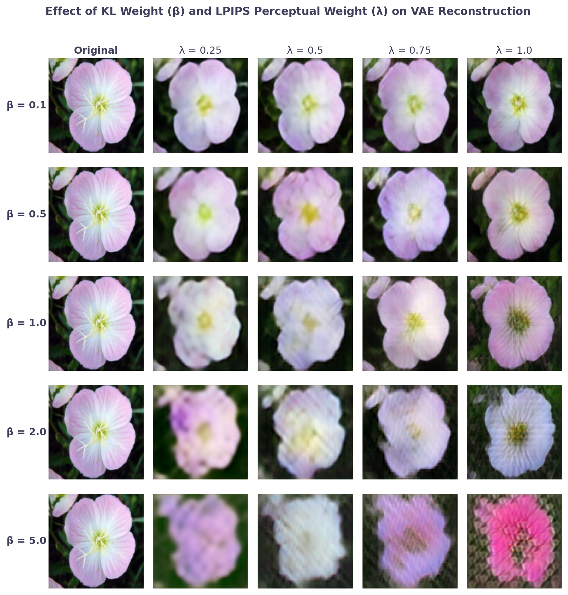
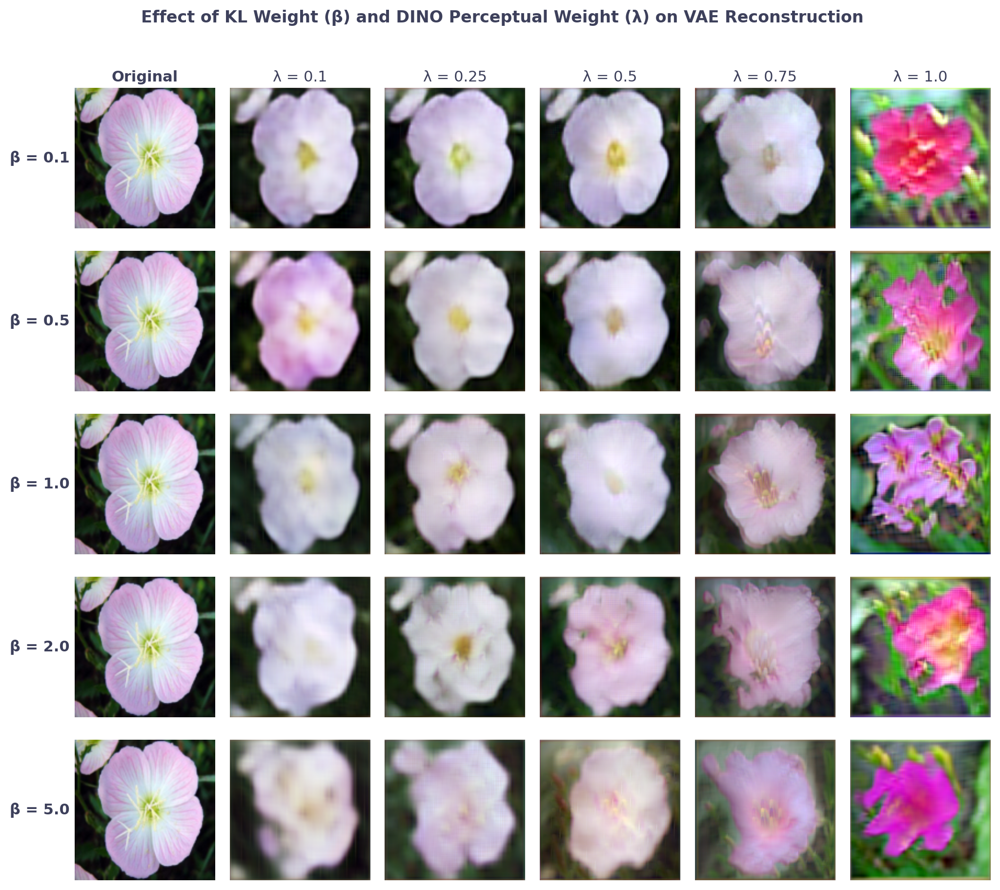
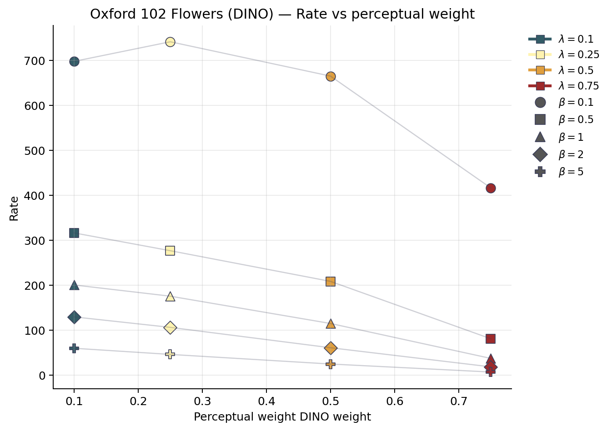
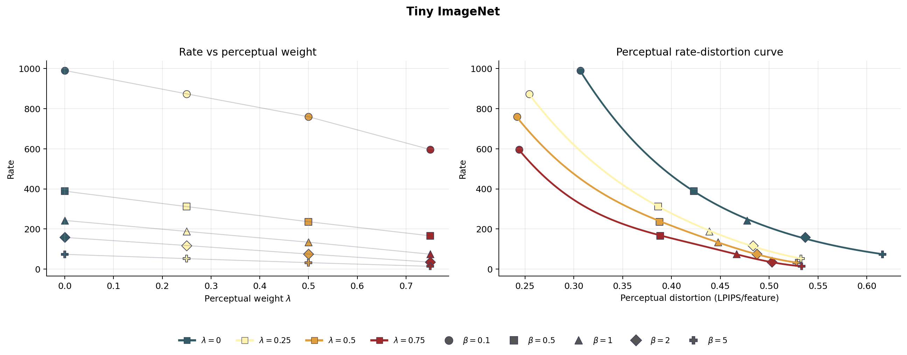

# ICML 2026 Rebuttal - Distortion Controls Rate: How VAEs Shape Latent Geometry

Supplementary figures for the rebuttal of our ICML 2026 submission.

## Oxford 102 Flowers

## Reconstruction Grid

## Reconstruction Grid

## Reconstruction Grid (DINO)

## Reconstruction Grid (DINO)

## Rate vs DINO

## Tiny ImageNet

